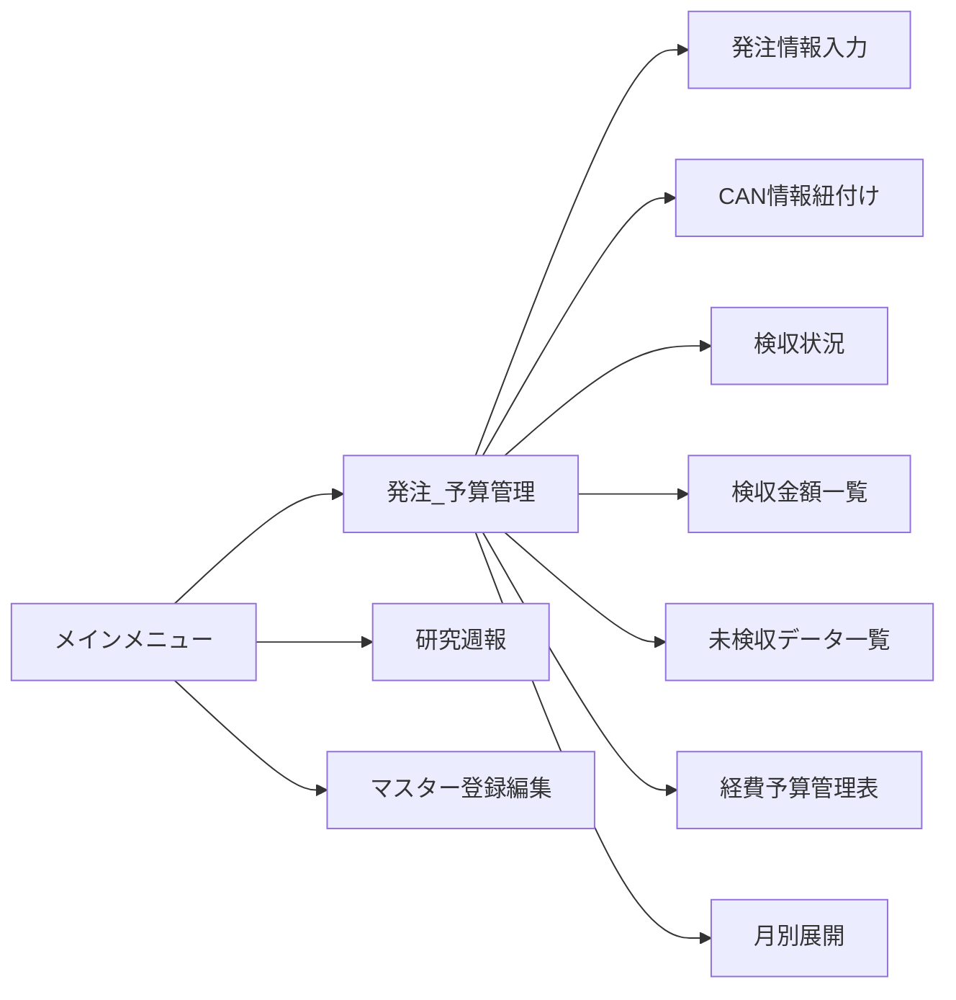
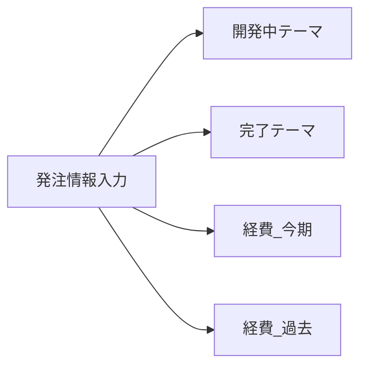

作成日 2022年11月9日
更新日 2022年11月9日
作成者 企画管理部 管理グループ 情報チーム

# 5W1H

## 何のためにやるのか(Why)
業務システムの予算、予算残、CAN発注、CAN検収、発注、検収金額の内訳がわかりにくいので明確にする

生産技術開発部で業務システムの改善案をまとめるための参考資料とする。

## いつやるか(When)
実施予定日 2022年11月9日～2022年11月10日

## どこでやるか(Where)
ここでやる

## 誰がやるのか(Who)
永井

## 何をするのか(What)
業務システムの各画面に表示されている各項目の内訳を明確にする。
各画面に表示している各項目の関係を明確にする

## どうやって実現するのか(How)
対象画面をキャプチャ
項目を画面に表示される数字で判断する
項目をソースファイルを見て判断する

※Mermaidでは使えない文字^[使えない文字は「！”＃＄％＆’（）＝＾〜｜￥１２３４５６７８９０＠｀「」｛｝；：＋＊＜＞、。・？＿」]がある。

